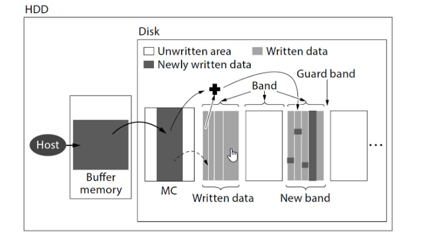

#### 🚀 RDT Revamp Project (Python/C)  
**Achievements:**  
- Led and managed the RDT Revamp project, developing test scripts (Python/C) based on real-world customer workloads for the first shingled magnetic recording HDD.  
- **Results:**  
  - 100% detection rate of field issues.
  - Addressed real-world application failures.
 

